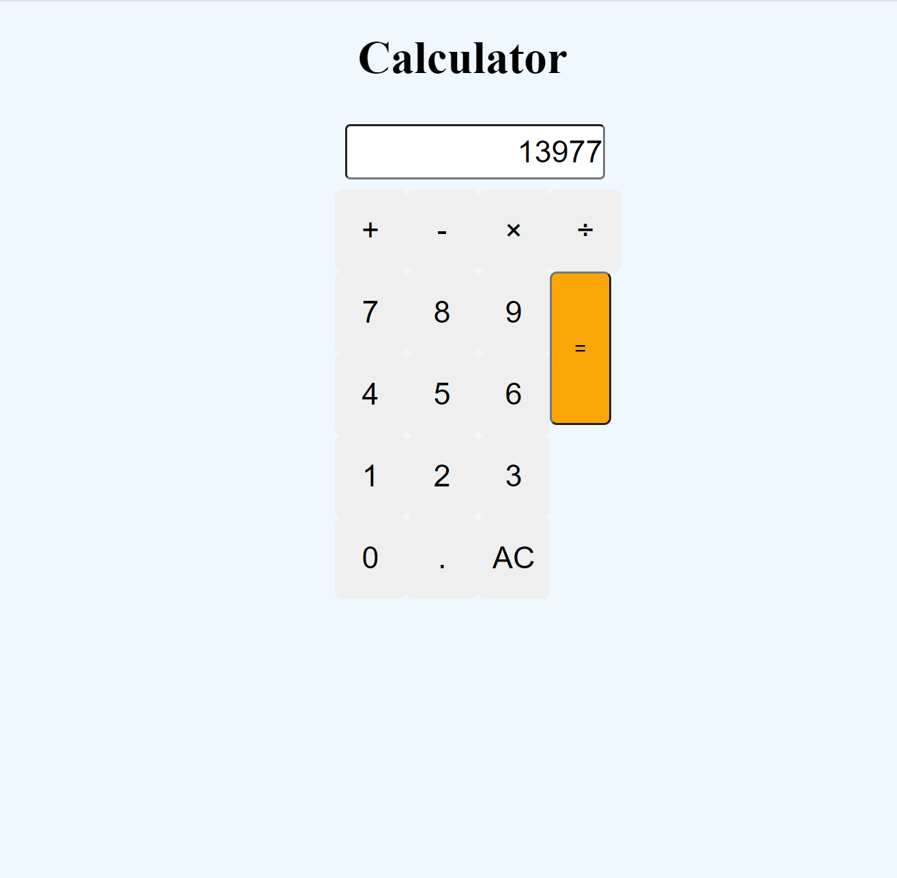

# MVC-techblog

-

## Table of contents

- [Description](#Description)
- [Links](#Links)
- [Resources](#Resources)
- [Screenshot](#Screenshot)
- [Walkthrough](#Walkthrough)

## Description

```
This project involves wiring up a simple calculator using Javascript.
```

## Links

- Link to Github Repository: https://github.com/urielrosario/MVC-techblog.git

## Resources

- https://stackoverflow.com/
- https://www.w3schools.com/

## Screenshot



## Walkthrough


